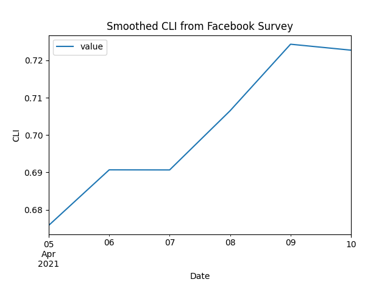

Getting started with epidatpy
=============================

The epidatpy package provides access to all the endpoints of the `Delphi Epidata
API <https://cmu-delphi.github.io/delphi-epidata/>`_, and can be used to make
requests for specific signals on specific dates and in select geographic
regions.

Setup
-----

**Installation**

You can install the stable version of this package from PyPi:

>>> pip install epidatpy

Or if you want the development version, install from GitHub:

>>> pip install -e "git+https://github.com/cmu-delphi/epidatpy.git#egg=epidatpy"

**API Keys**

The Delphi API requires a (free) API key for full functionality. While most
endpoints are available without one, there are
`limits on API usage for anonymous users <https://cmu-delphi.github.io/delphi-epidata/api/api_keys.html>`_,
including a rate limit.

To generate your key,
`register for a pseudo-anonymous account <https://api.delphi.cmu.edu/epidata/admin/registration_form>`_.

*Note* that private endpoints (i.e. those prefixed with ``pvt_``) require a
separate key that needs to be passed as an argument. These endpoints require
specific data use agreements to access.

Basic Usage
-----------

Fetching data from the Delphi Epidata API is simple. Suppose we are
interested in the ``covidcast``
`endpoint <https://cmu-delphi.github.io/delphi-epidata/api/covidcast.html>`_,
which provides access to a
`wide range of data <https://cmu-delphi.github.io/delphi-epidata/api/covidcast_signals.html>`_
on COVID-19. Reviewing the endpoint documentation, we see that we
`need to specify <https://cmu-delphi.github.io/delphi-epidata/api/covidcast.html#constructing-api-queries>`_
a data source name, a signal name, a geographic level, a time resolution, and
the location and times of interest.

The ``pub_covidcast`` function lets us access the ``covidcast`` endpoint:

>>> from epidatpy import EpiDataContext, EpiRange
>>> epidata = EpiDataContext(use_cache=True, cache_max_age_days=1)
>>> # Obtain the most up-to-date version of the smoothed covid-like illness (CLI)
>>> # signal from the COVID-19 Trends and Impact survey for the US
>>> apicall = epidata.pub_covidcast(
...    data_source = "fb-survey",
...    signals = "smoothed_cli", 
...    geo_type = "nation",
...    time_type = "day",
...    geo_values = "us",
...    time_values = EpiRange(20210405, 20210410))
EpiDataCall(endpoint=covidcast/, params={'data_source': 'fb-survey', 'signals': 'smoothed_cli', 'geo_type': 'nation', 'time_type': 'day', 'geo_values': 'us', 'time_values': '20210405-20210410'})

``pub_covidcast`` returns an ``EpiDataCall``, which can be further converted into different output formats - such as a Pandas DataFrame:

>>> data = apicall.df()
>>> data.head()
      source        signal geo_type geo_value time_type time_value      issue  lag     value    stderr  sample_size  direction  missing_value  missing_stderr  missing_sample_size
0  fb-survey  smoothed_cli   nation        us       day 2021-04-05 2021-04-10    5  0.675832  0.014826       244046       <NA>              0               0                    0
1  fb-survey  smoothed_cli   nation        us       day 2021-04-06 2021-04-11    5  0.690687  0.014998       242979       <NA>              0               0                    0
2  fb-survey  smoothed_cli   nation        us       day 2021-04-07 2021-04-12    5  0.690664  0.015023       242153       <NA>              0               0                    0
3  fb-survey  smoothed_cli   nation        us       day 2021-04-08 2021-04-13    5  0.706503  0.015236       241380       <NA>              0               0                    0
4  fb-survey  smoothed_cli   nation        us       day 2021-04-09 2021-04-14    5  0.724306  0.015466       240256       <NA>              0               0                    0

Each row represents one observation in the US on one
day. The geographical abbreviation is given in the ``geo_value`` column, the date in
the ``time_value`` column. Here `value` is the requested signal -- in this
case, the smoothed estimate of the percentage of people with COVID-like
illness, based on the symptom surveys, and ``stderr`` is its standard error.

The Epidata API makes signals available at different geographic levels,
depending on the endpoint. To request signals for all states instead of the
entire US, we use the ``geo_type`` argument paired with ``*`` for the
``geo_values`` argument. (Only some endpoints allow for the use of ``*`` to
access data at all locations. Check the help for a given endpoint to see if
it supports ``*``.)

>>> apicall = epidata.pub_covidcast(
...    data_source = "fb-survey",
...    signals = "smoothed_cli", 
...    geo_type = "state",
...    time_type = "day",
...    geo_values = "*",
...    time_values = EpiRange(20210405, 20210410))
EpiDataCall(endpoint=covidcast/, params={'data_source': 'fb-survey', 'signals': 'smoothed_cli', 'geo_type': 'state', 'time_type': 'day', 'geo_values': '*', 'time_values': '20210405-20210410'})
>>> apicall.df.head()
      source        signal geo_type geo_value time_type time_value      issue  lag     value    stderr sample_size  direction  missing_value  missing_stderr  missing_sample_size
0  fb-survey  smoothed_cli    state        ak       day 2021-04-05 2021-04-10    5  0.736883  0.275805       720.0       <NA>              0               0                    0
1  fb-survey  smoothed_cli    state        al       day 2021-04-05 2021-04-10    5  0.796627  0.137734   3332.1117       <NA>              0               0                    0
2  fb-survey  smoothed_cli    state        ar       day 2021-04-05 2021-04-10    5  0.561916  0.131108   2354.9911       <NA>              0               0                    0
3  fb-survey  smoothed_cli    state        az       day 2021-04-05 2021-04-10    5   0.62283  0.105354   4742.2778       <NA>              0               0                    0
4  fb-survey  smoothed_cli    state        ca       day 2021-04-05 2021-04-10    5  0.444169  0.040576  21382.3806       <NA>              0               0                    0

We can fetch a subset of states by listing out the desired locations:

>>> apicall = epidata.pub_covidcast(
...    data_source = "fb-survey",
...    signals = "smoothed_cli", 
...    geo_type = "state",
...    time_type = "day",
...    geo_values = "pa,ca,fl",
...    time_values = EpiRange(20210405, 20210410))
EpiDataCall(endpoint=covidcast/, params={'data_source': 'fb-survey', 'signals': 'smoothed_cli', 'geo_type': 'state', 'time_type': 'day', 'geo_values': 'pa,ca,fl', 'time_values': '20210405-20210410'})
>>> apicall.df.head()
      source        signal geo_type geo_value time_type time_value      issue  lag     value    stderr sample_size  direction  missing_value  missing_stderr  missing_sample_size
0  fb-survey  smoothed_cli    state        ca       day 2021-04-05 2021-04-10    5  0.444169  0.040576  21382.3806       <NA>              0               0                    0
1  fb-survey  smoothed_cli    state        fl       day 2021-04-05 2021-04-10    5  0.690415  0.058204  16099.0005       <NA>              0               0                    0
2  fb-survey  smoothed_cli    state        pa       day 2021-04-05 2021-04-10    5  0.715758  0.072999  10894.0057       <NA>              0               0                    0
3  fb-survey  smoothed_cli    state        ca       day 2021-04-06 2021-04-11    5   0.45604   0.04127  21176.3902       <NA>              0               0                    0
4  fb-survey  smoothed_cli    state        fl       day 2021-04-06 2021-04-11    5  0.730692  0.059907  15975.0007       <NA>              0               0                    0

We can also request data for a single location at a time, via the ``geo_values`` argument.

>>> apicall = epidata.pub_covidcast(
...    data_source = "fb-survey",
...    signals = "smoothed_cli", 
...    geo_type = "state",
...    time_type = "day",
...    geo_values = "pa,ca,fl",
...    time_values = EpiRange(20210405, 20210410))
EpiDataCall(endpoint=covidcast/, params={'data_source': 'fb-survey', 'signals': 'smoothed_cli', 'geo_type': 'state', 'time_type': 'day', 'geo_values': 'pa', 'time_values': '20210405-20210410'})
>>> apicall.df.head()
      source        signal geo_type geo_value time_type time_value      issue  lag     value    stderr sample_size  direction  missing_value  missing_stderr  missing_sample_size
0  fb-survey  smoothed_cli    state        pa       day 2021-04-05 2021-04-10    5  0.715758  0.072999  10894.0057       <NA>              0               0                    0
1  fb-survey  smoothed_cli    state        pa       day 2021-04-06 2021-04-11    5   0.69321  0.070869  10862.0055       <NA>              0               0                    0
2  fb-survey  smoothed_cli    state        pa       day 2021-04-07 2021-04-12    5  0.685934  0.070654  10790.0054       <NA>              0               0                    0
3  fb-survey  smoothed_cli    state        pa       day 2021-04-08 2021-04-13    5  0.681511  0.071394  10731.0044       <NA>              0               0                    0
4  fb-survey  smoothed_cli    state        pa       day 2021-04-09 2021-04-14    5  0.709416  0.072162  10590.0049       <NA>              0               0                    0

Getting versioned data
----------------------

The Epidata API stores a historical record of all data, including corrections
and updates, which is particularly useful for accurately backtesting
forecasting models. To fetch versioned data, we can use the ``as_of``
argument:

>>> apicall = epidata.pub_covidcast(
...    data_source = "fb-survey",
...    signals = "smoothed_cli", 
...    geo_type = "state",
...    time_type = "day",
...    geo_values = "pa,ca,fl",
...    time_values = EpiRange(20210405, 20210410),
...    as_of = "2021-06-01")

Plotting
--------

Because the output data is a standard Pandas DataFrame, we can easily plot
it using any of the available Python libraries:

>>> data.plot(x="time_value", y="value", title="Smoothed CLI from Facebook Survey", xlabel="Date", ylabel="CLI")

Finding locations of interest
-----------------------------

Most data is only available for the US. Select endpoints report other countries at the national and/or regional levels. Endpoint descriptions explicitly state when they cover non-US locations.

For endpoints that report US data, see the
`geographic coding documentation <https://cmu-delphi.github.io/delphi-epidata/api/covidcast_geography.html>`_
for available geographic levels.

International data
------------------

International data is available via

- ``pub_dengue_nowcast`` (North and South America)
- ``pub_ecdc_ili`` (Europe)
- ``pub_kcdc_ili`` (Korea)
- ``pub_nidss_dengue`` (Taiwan)
- ``pub_nidss_flu`` (Taiwan)
- ``pub_paho_dengue`` (North and South America)
- ``pvt_dengue_sensors`` (North and South America)

Finding data sources and signals of interest
--------------------------------------------

Above we used data from `Delphi’s symptom surveys <https://delphi.cmu.edu/covid19/ctis/>`_,
but the Epidata API includes numerous data streams: medical claims data, cases
and deaths, mobility, and many others. This can make it a challenge to find
the data stream that you are most interested in.

The Epidata documentation lists all the data sources and signals available
through the API for `COVID-19 <https://cmu-delphi.github.io/delphi-epidata/api/covidcast_signals.html>`_
and for `other diseases <https://cmu-delphi.github.io/delphi-epidata/api/README.html#source-specific-parameters>`_.
