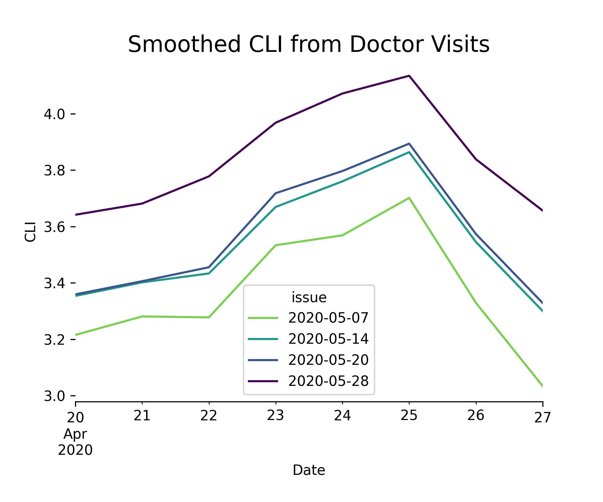

Understanding and accessing versioned data
==========================================

The Epidata API records not just each signal's estimate for a given location
on a given day, but also *when* that estimate was made, and all updates to that
estimate.

For example, let's look at the `doctor visits
signal <https://cmu-delphi.github.io/delphi-epidata/api/covidcast-signals/doctor-visits.html>`_
from the ``covidcast`` `endpoint <https://cmu-delphi.github.io/delphi-epidata/api/covidcast.html>`_,
which estimates the percentage of outpatient doctor visits that are
COVID-related.

Consider a result row with ``time_value = 2020-05-01`` for
``geo_values = "pa"``. This is an estimate for Pennsylvania on
May 1, 2020. That estimate was *issued* on May 5, 2020, the delay being due to
the aggregation of data by our source and the time taken by the Epidata API to
ingest the data provided.

Later, the estimate for May 1st could be updated,
perhaps because additional visit data from May 1st arrived at our source and was
reported to us. This constitutes a new *issue* of the data.

Data known "as of" a specific date
----------------------------------

By default, endpoint functions fetch the most recent issue available. This
is the best option for users who simply want to graph the latest data or
construct dashboards. But if we are interested in knowing *when* data was
reported, we can request specific data versions using the ``as_of``, ``issues``, or
``lag`` arguments.

**Note** that these are mutually exclusive; only one can be specified
at a time. Also, not all endpoints support all three parameters, so please
check the documentation for that specific endpoint.

First, we can request the data that was available *as of* a specific date, using
the ``as_of`` argument:

.. exec::
   :context: true

   from epidatpy import EpiDataContext, EpiRange
   import pandas as pd

   # Set common options and context
   pd.set_option('display.max_columns', None)
   pd.set_option('display.max_rows', None)
   pd.set_option('display.width', 1000)

   epidata = EpiDataContext(use_cache=False)

   # Obtain the most up-to-date version of the smoothed covid-like illness (CLI)
   # signal from the COVID-19 Trends and Impact survey for the US
   apicall = epidata.pub_covidcast(
      data_source = "doctor-visits",
      signals = "smoothed_cli",
      time_type = "day",
      time_values = EpiRange("2020-05-01", "2020-05-01"),
      geo_type = "state",
      geo_values = "pa",
      as_of = "2020-05-07")
   
   print(apicall.df().head())
   print(apicall.df().head()["value"])

This shows that an estimate of about 2.3% was issued on May 7. If we don't
specify `as_of`, we get the most recent estimate available:

.. exec::
   :context: true

   apicall = epidata.pub_covidcast(
      data_source = "doctor-visits",
      signals = "smoothed_cli",
      time_type = "day",
      time_values = EpiRange("2020-05-01", "2020-05-01"),
      geo_type = "state",
      geo_values = "pa")
   
   print(apicall.df().head())
   print(apicall.df().head()["value"])

Note the substantial change in the estimate, from less than 3% to over 5%,
reflecting new data that became available after May 7 about visits *occurring on*
May 1. This illustrates the importance of issue date tracking, particularly
for forecasting tasks. To backtest a forecasting model on past data, it is
important to use the data that would have been available *at the time* the model
was or would have been fit, not data that arrived much later.

By plotting API results with different values of the ``as_of`` parameter, we can
see how the indicator value changes over time as new observations become available:

.. code-block:: python

   results = []
   for as_of_date in ["2020-05-07", "2020-05-14", "2020-05-21", "2020-05-28"]:
      apicall = epidata.pub_covidcast(
         data_source = "doctor-visits",
         signals = "smoothed_adj_cli",
         time_type = "day",
         time_values = EpiRange("2020-04-20", "2020-04-27"),
         geo_type = "state",
         geo_values = "pa",
         as_of = as_of_date)

      results.append(apicall.df())

   final_df = pd.concat(results)
   final_df["issue"] = final_df["issue"].dt.date

   fig, ax = plt.subplots(figsize=(6, 5))
   ax.spines["right"].set_visible(False)
   ax.spines["left"].set_visible(False)
   ax.spines["top"].set_visible(False)

   def sub_cmap(cmap, vmin, vmax):
      return lambda v: cmap(vmin + (vmax - vmin) * v)

   final_df.pivot_table(values = "value", index = "time_value", columns = "issue").plot(
      xlabel="Date",
      ylabel="CLI",
      ax = ax,
      linewidth = 1.5,
      colormap=sub_cmap(plt.get_cmap('viridis').reversed(), 0.2, 1)
   )

   plt.title("Smoothed CLI from Doctor Visits", fontsize=16)
   plt.subplots_adjust(bottom=.2)
   plt.show()

Multiple issues of observations
-------------------------------

By using the ``issues`` argument, we can request all issues in a certain time
period:

.. exec::
   :context: true

   apicall = epidata.pub_covidcast(
      data_source = "doctor-visits",
      signals = "smoothed_adj_cli",
      time_type = "day",
      time_values = EpiRange("2020-05-01", "2020-05-01"),
      geo_type = "state",
      geo_values = "pa",
      issues = EpiRange("2020-05-01", "2020-05-15"))
   
   print(apicall.df().head(7))

This estimate was clearly updated many times as new data for May 1st arrived.

**Note** that these results include only data issued or updated between
(inclusive) 2020-05-01 and 2020-05-15. If a value was first reported on
2020-04-15, and never updated, a query for issues between 2020-05-01 and
2020-05-15 will not include that value among its results.

Observations issued with a specific lag
---------------------------------------

Finally, we can use the ``lag`` argument to request only data reported with a
certain lag. For example, requesting a lag of 7 days fetches only data issued
exactly 7 days after the corresponding ``time_value``:

.. exec::
   :context: true

   apicall = epidata.pub_covidcast(
      data_source = "doctor-visits",
      signals = "smoothed_adj_cli",
      time_type = "day",
      time_values = EpiRange("2020-05-01", "2020-05-01"),
      geo_type = "state",
      geo_values = "pa",
      lag = 7)
   
   print(apicall.df().head())

**Note** that though this query requested all values between 2020-05-01 and
2020-05-07, May 3rd and May 4th were *not* included in the results set. This is
because the query will only include a result for May 3rd if a value were issued
on May 10th (a 7-day lag), but in fact the value was not updated on that day:

.. exec::
   :context: true

   apicall = epidata.pub_covidcast(
      data_source = "doctor-visits",
      signals = "smoothed_adj_cli",
      time_type = "day",
      time_values = EpiRange("2020-05-03", "2020-05-03"),
      geo_type = "state",
      geo_values = "pa",
      issues = EpiRange("2020-05-09", "2020-05-15"))
   
   print(apicall.df().head())
